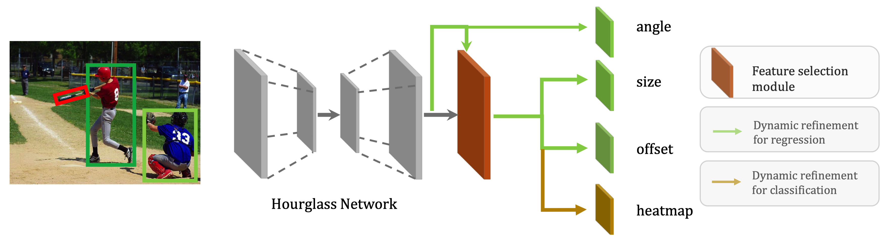

# DRN and SKU110K-R
#### Xingjia Pan, Yuqiang Ren, Kekai Sheng, Weiming Dong, Haolei Yuan, Xiaowei Guo, Chongyang Ma, Changsheng Xu

### Work in process.

 Dynamic Refinement Network for Oriented and Densely Packed Object Detection[[Paper Link]](https://arxiv.org/abs/2005.09973)



Figure 1. Overall framework of our Dynamic Refinement Network. The backbone network is followed by two modules, i.e., feature selection module (FSM) and dynamic refinement heads (DRHs). FSM selects the most suitable features by adaptively adjusting receptive fields. The DRHs dynamically refine the predictions in an object-aware manner.

## SKU110K-R


Figure 2. Some sample images from SKU110K. The images in top row are annotated with horizontal bounding boxes while the images in bottom row are with oriented bounding boxes.

To use SKU110K-R,

0. Download the original SKU110K data set from [website](https://github.com/eg4000/SKU110K_CVPR19) and extract images

1. Generate SKU110K-R using our rotate augment script

```
   python rotate_augment.py path/to/images
```

2. Download the annotations for SKU110K-R from [website](https://drive.google.com/file/d/1_5JsVc_A5vWm-d-JXMJdX0Lx5FIlgAXJ/view?usp=sharing)

The annotation is in coco format.

## Evaluation tools
### cocoapi_ro 
we provide a variant of cocoapi for evaluation of rotated bounding boxes. 

0. Install cocoapi_ro(similar with cocoapi)

```
   cd PythonAPi
   make
```

1. Replace pycocotools with pycocotools_ro

**FROM**
```
   import pycocotools.coco as coco
   from pycocotools.cocoeval import COCOeval
```
**TO** 
```
   import pycocotools_ro.coco as coco
   from pycocotools_ro.cocoeval import COCOeval
```

2. Update the evaluation code.

**FROM**
```
   coco_eval = COCOeval(self.coco, coco_dets, "bbox")
```
**TO** 
```
   coco_eval = COCOeval(self.coco, coco_dets, "rbbox")
```
### angle_nms
we provide **angle_nms** for nms of rotated bounding box in post process.

```
   from angle_nms.angle_soft_nms import angle_soft_nms
   # Example
   result_after_nms = angle_soft_nms(all_dets, Nt=0.5, method=1,threshold=0.05)
   all_dets: detection results
   Nt: iou threshold 
   method: 1, linear soft nms; 2, gaussian soft nms; other, nms
   threshold: the minimum confidence valu to retain the detection bbox
```

## Citation

If you find this project useful for your research, please use the following BibTeX entry.
```
@article{pan2020dynamic,
  title={Dynamic Refinement Network for Oriented and Densely Packed Object Detection},
  author={Xingjia Pan and Yuqiang Ren and Kekai Sheng and Weiming Dong and Haolei Yuan and Xiaowei Guo and Chongyang Ma and Changsheng Xu},
  booktitle={CVPR},
  pages={1--8},
  year={2020}
}
```
## Contacts
If you have any questions about our work, please do not hesitate to contact us by emails.  
Xingjia Pan: xingjia.pan@nlpr.ia.ac.cn  
Yuqiang Ren: condiren@tencent.com
